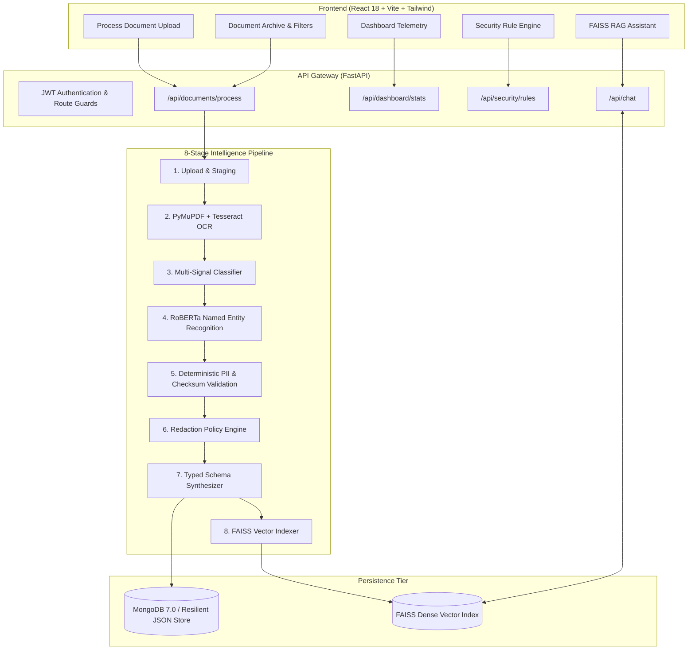

# DOCINTEL AI
### Enterprise Document Intelligence & Secure Data Extraction Platform

[](https://fastapi.tiangolo.com/)
[](https://reactjs.org/)
[](https://www.typescriptlang.org/)
[](https://tailwindcss.com/)
[](https://pytorch.org/)
[](https://huggingface.co/)
[](https://github.com/facebookresearch/faiss)
[](https://www.mongodb.com/)

---

## 📌 Executive Summary

Modern enterprise organizations process thousands of complex documents daily — including **invoices, legal agreements, vendor contracts, government identity cards, and onboarding application forms**. 

Manual document processing introduces severe operational pain points:
- ⏳ **High Inefficiency:** ~6 minutes of manual data entry per document.
- ❌ **Human Error:** Typographical errors in bank accounts, invoice numbers, tax IDs, and billing amounts.
- 🔒 **Data Privacy Exposure:** Uncontrolled leakage of Personally Identifiable Information (PII) such as Indian **Aadhaar numbers, PAN cards, credit cards, bank accounts, and personal emails**.
- 🗄️ **Unsearchable Silos:** Scanned images and flattened PDFs remain inaccessible to semantic search and automated workflows.

**DOCINTEL AI** is a full-stack, enterprise-grade platform designed to automatically ingest, OCR, classify, redact, validate, extract, and index documents into a vector-grounded conversational AI assistant with zero hallucinations.

---

## 🚀 Key Platform Capabilities

| Capability | Engineering Implementation |
|---|---|
| 📄 **Multi-Format Ingestion** | High-resolution PDF parsing via **PyMuPDF (fitz)** with 300-DPI rasterization and image preprocessing (contrast, sharpness, adaptive thresholding) for **Tesseract OCR**. |
| 🏷️ **Multi-Signal Classification** | Weighted keyword density and contextual regex engine categorizing documents into `Invoice`, `Contract`, `Identity`, `Application`, `Form`, or `Other`. |
| 🧠 **RoBERTa Token NER** | Hugging Face Transformers token classification (`Jean-Baptiste/roberta-large-ner-english`) extracting `PERSON`, `ORGANIZATION`, `LOCATION`, and `DATE` with confidence scores. |
| 🛡️ **Algorithmic PII Validation** | Deterministic regex coupled with **Verhoeff algorithm** (Aadhaar 12-digit checksum), **Luhn MOD-10 algorithm** (credit cards), and Indian Income Tax Department status validation (PAN). |
| 🔒 **Dynamic Redaction Engine** | Enterprise security policies persisted in MongoDB that mask sensitive fields (e.g. `XXXX XXXX 9012`, `XXXXX1234F`, `r***@example.com`) across UI and text storage. |
| 📊 **Typed Schema Extraction** | Domain schema synthesis extracting invoices (subtotal, tax, currency, vendor, dates), contracts (parties, governing law), and identity credentials without hallucination. |
| ⚡ **Conversational RAG Assistant** | SentenceTransformers (`all-MiniLM-L6-v2`) chunking and embedding documents into **FAISS** vector store for context-grounded conversational QA with source citations. |
| 📈 **Live Telemetry Dashboard** | Real-time MongoDB metrics: Total Processed, Extraction Accuracy (%), Protected Entities, and Calculated Time Saved. |
| 🔄 **Zero-Config Resilient Store** | Transparent local persistent fallback (`data/local_db.json`) allowing immediate full functionality on any machine without requiring an active MongoDB daemon. |

---

## 🏗️ System Architecture & AI Pipeline



---

## 📂 Project Structure

```
DocIntel-AI/
├── .gitignore
├── docker-compose.yml               # Multi-container stack (Mongo + Backend + Frontend)
├── README.md                        # Master project documentation
│
├── backend/
│   ├── .env.example                 # Environment configuration template
│   ├── Dockerfile                   # Backend Docker container with Tesseract OCR
│   ├── README.md
│   ├── requirements.txt             # Python dependencies
│   │
│   ├── app/
│   │   ├── __init__.py
│   │   ├── config.py                # Pydantic v2 application settings
│   │   ├── database.py              # MongoDB async manager + local JSON fallback
│   │   ├── main.py                  # FastAPI entry point, lifespan, CORS, and exception handler
│   │   │
│   │   ├── api/                     # REST API Routers
│   │   │   ├── auth.py              # Register, login, JWT /me
│   │   │   ├── chat.py              # RAG conversational query answering
│   │   │   ├── dashboard.py         # Real-time metrics and recent document feeds
│   │   │   ├── documents.py         # File ingestion, archive list, details, delete, download
│   │   │   ├── search.py            # Global substring & entity search with snippet generation
│   │   │   └── security.py          # Dynamic PII masking rules engine
│   │   │
│   │   ├── models/                  # Domain Models
│   │   │   ├── document.py          # DocumentModel, EntityModel, PIIModel
│   │   │   ├── security.py          # SecurityRuleModel
│   │   │   └── user.py              # UserModel
│   │   │
│   │   ├── schemas/                 # Pydantic Schemas
│   │   │   ├── auth.py              # UserRegister, UserLogin, TokenResponse
│   │   │   ├── chat.py              # ChatRequest, ChatResponse, SourceReference
│   │   │   ├── dashboard.py         # DashboardStats, RecentDocumentItem
│   │   │   ├── document.py          # DocumentResponse, PipelineStep, Typed Schemas
│   │   │   └── security.py          # SecurityRule, SecurityRuleUpdate
│   │   │
│   │   ├── services/                # Business & AI Intelligence Services
│   │   │   ├── document_classifier.py    # Invoice/Contract/Identity multi-signal classifier
│   │   │   ├── document_service.py       # Master 12-step pipeline orchestrator
│   │   │   ├── embedding_service.py      # SentenceTransformers dense vector embeddings
│   │   │   ├── ner_service.py            # RoBERTa token classification (NER)
│   │   │   ├── ocr_service.py            # PyMuPDF + Tesseract OCR engine
│   │   │   ├── pii_service.py            # Regex + context PII detection
│   │   │   ├── rag_service.py            # FAISS index management & grounded synthesis
│   │   │   ├── redaction_service.py      # Masking policies for sensitive entities
│   │   │   ├── structured_extraction.py  # Structured typed JSON schema generation
│   │   │   └── validation_service.py     # Verhoeff (Aadhaar), Luhn (Cards), PAN checksums
│   │   │
│   │   └── utils/
│   │       └── security.py          # Password hashing & JWT token verification
│   │
│   └── tests/                       # Automated Pytest Suite (23 Tests)
│       ├── conftest.py              # TestClient & database session setup
│       ├── test_auth.py             # User registration, login, token guards
│       ├── test_dashboard_search.py # Dashboard stats, search, security rules, chat
│       ├── test_documents.py        # Upload, processing pipeline, file validation
│       ├── test_ner.py              # RoBERTa label mapping & entity deduplication
│       ├── test_ocr.py              # Image preprocessing, PDF extraction, extensions
│       ├── test_pii_redaction.py    # Aadhaar, PAN, Luhn validation & masking
│       └── test_structured_extraction.py # Category classification & schema extraction
│
├── frontend/
│   ├── .env.example
│   ├── Dockerfile                   # Multi-stage build with Nginx Alpine serving
│   ├── index.html                   # HTML5 shell
│   ├── nginx.conf                   # Reverse proxy & SPA routing configuration
│   ├── package.json
│   ├── tailwind.config.js           # Enterprise Navy & Brand color theme
│   ├── tsconfig.json                # TypeScript strict configuration
│   ├── vite.config.ts
│   │
│   └── src/
│       ├── App.tsx                  # React Router routes & auth provider shell
│       ├── index.css                # Tailwind directives & custom scrollbars
│       ├── main.tsx                 # React DOM mount point
│       ├── vite-env.d.ts            # Vite client environment types
│       │
│       ├── components/              # Reusable UI Components
│       │   ├── Navbar.tsx           # Global search with live dropdown, user profile
│       │   ├── PipelineVisualizer.tsx # Interactive 8-stage visual pipeline timeline
│       │   ├── Sidebar.tsx          # Navy enterprise navigation sidebar
│       │   ├── StatCard.tsx         # Dashboard metric card with trends
│       │   └── Toast.tsx            # Floating toast notification system
│       │
│       ├── hooks/
│       │   └── useAuth.tsx          # JWT auth context with localStorage persistence
│       │
│       ├── layouts/
│       │   └── DashboardLayout.tsx  # Authenticated shell layout
│       │
│       ├── pages/                   # Application Pages
│       │   ├── AIAssistant.tsx      # RAG assistant with grounded source citations
│       │   ├── Dashboard.tsx        # Real-time metrics & recent documents table
│       │   ├── DocumentArchive.tsx  # Filterable document database with pagination
│       │   ├── DocumentDetails.tsx  # Schema fields, entities, masked PII, OCR diff
│       │   ├── Login.tsx            # Login page with demo credentials auto-fill
│       │   ├── ProcessDocument.tsx  # Drag & drop upload, pipeline visualizer, tabbed results
│       │   ├── Register.tsx         # User registration
│       │   └── SecurityRules.tsx    # Toggleable PII redaction policy rules
│       │
│       ├── services/
│       │   └── api.ts               # Axios client with JWT interceptor & progress events
│       │
│       ├── types/
│       │   └── index.ts             # Complete TypeScript interface definitions
│       │
│       └── utils/
│           ├── formatters.ts        # Byte, date, confidence, and badge color formatters
│           └── index.ts
│
├── data/
│   ├── local_db.json                # Pre-seeded local persistent JSON store
│   ├── processed/                   # Processed documents staging
│   ├── sample_documents/            # Synthetic PDF and PNG invoices, contracts, IDs
│   └── vector_index/                # FAISS binary vector index + metadata chunks
│
├── docs/
│   ├── api.md                       # Full REST API documentation & JSON request/response
│   ├── architecture.md              # System architecture & Mermaid sequence diagram
│   └── demo.md                      # 5-minute hackathon evaluation guide
│
└── scripts/
    ├── create_sample_docs.py        # High-res sample invoice, contract, ID generator
    ├── seed_database.py             # Seeds admin user and default security rules
    └── test_pipeline.py             # End-to-end pipeline smoke test
```

---

## 🛠️ Local Development & Setup (Windows)

### Prerequisites
- **Python 3.11+** installed and added to `PATH`
- **Node.js 18+** & `npm`
- *(Optional)* **Tesseract OCR for Windows**: [UB-Mannheim/tesseract/wiki](https://github.com/UB-Mannheim/tesseract/wiki) (Defaults to `C:\Program Files\Tesseract-OCR\tesseract.exe`)
- *(Optional)* **MongoDB 7.0**: If MongoDB is not running, the platform automatically uses `data/local_db.json` without any crash or manual intervention!

---

### 1. Backend Service (FastAPI)

```powershell
# Open terminal in project root:
cd backend

# Create and activate virtual environment
python -m venv .venv
.venv\Scripts\activate

# Upgrade pip and install dependencies
python -m pip install --upgrade pip
pip install -r requirements.txt

# Create environment configuration
copy .env.example .env

# Run FastAPI server
uvicorn app.main:app --reload --port 8000
```
- **API Swagger Documentation:** [http://localhost:8000/docs](http://localhost:8000/docs)
- **ReDoc Interactive UI:** [http://localhost:8000/redoc](http://localhost:8000/redoc)
- **Health Check Endpoint:** [http://localhost:8000/api/health](http://localhost:8000/api/health)

---

### 2. Frontend Application (React + Vite + TypeScript)

```powershell
# Open a second PowerShell terminal:
cd frontend

# Install Node dependencies
npm install

# Create environment configuration
copy .env.example .env

# Start Vite development server
npm run dev
```
- **Web Application UI:** [http://localhost:5173](http://localhost:5173)

---

### 3. Database Seeding & Pipeline Smoke Test

```powershell
# In your backend virtual environment:
python scripts/create_sample_docs.py
python scripts/seed_database.py
python scripts/test_pipeline.py
```

**Default Admin Credentials:**
- **Email:** `admin@docintel.ai`
- **Password:** `Admin@12345`  
*(Or click "Fill Default Demo Admin" on the login page for 1-click access)*

---

## 🧪 Automated Testing & Verification

### Run Backend Pytest Suite
```powershell
cd backend
python -m pytest tests/ -v
```
**Result:** **23 / 23 Tests Passed** across all core modules:
- `test_auth.py`: Registration, duplicate prevention, login, JWT bearer validation, `/me` endpoint
- `test_ocr.py`: PIL image preprocessing, PDF page extraction, extension verification
- `test_ner.py`: RoBERTa token classification, label normalization (`PER` → `PERSON`), deduplication
- `test_pii_redaction.py`: Aadhaar Verhoeff checksum, PAN tax code validation, Luhn card check, masking
- `test_structured_extraction.py`: Invoice, Contract, Identity classification and typed schema generation
- `test_documents.py`: File ingestion, storage, retrieval, delete, and download
- `test_dashboard_search.py`: Real-time metric calculation, substring query search, rule updates, RAG chat

### Run End-to-End Pipeline Smoke Test
```powershell
python scripts/test_pipeline.py
```
**Result:** Successfully validates file upload → OCR text extraction → classification → RoBERTa NER → deterministic PII detection → validation & redaction → structured schema synthesis → MongoDB persistence → FAISS vector indexing & RAG retrieval.

### Run Frontend Production Build
```powershell
cd frontend
npm run build
```
**Result:** Compiles with **zero TypeScript errors** and generates optimized bundle in `frontend/dist/`.

---

## 🐳 Docker Multi-Container Stack

Launch full containerized environment including MongoDB, FastAPI backend with Tesseract OCR, and Nginx-hosted React frontend:

```powershell
docker-compose up --build
```
- **Frontend Application:** [http://localhost:5173](http://localhost:5173)
- **Backend API Docs:** [http://localhost:8000/docs](http://localhost:8000/docs)
- **MongoDB:** `localhost:27017`

---

## 🛡️ Security & Privacy Features

1. **Zero Secret Exposure:** No API keys, database credentials, or secret keys exist in client-side code or Git history.
2. **PII Redaction Before Vectorization:** Only masked, sanitized text chunks are embedded and stored in the FAISS index to prevent sensitive PII leakage through embeddings.
3. **Anti-Hallucination RAG Guardrails:** The conversational AI assistant answers questions strictly using retrieved document context. When information is not present in indexed documents, it answers:
   > *"I couldn't find that information in the available documents."*
4. **Algorithmic Checksums:** Validates 12-digit Indian Aadhaar numbers using the Verhoeff multiplication table and credit cards using the Luhn MOD-10 algorithm.

---

## 📋 Hackathon Demo Walkthrough (5 Minutes)

1. **Login:** Navigate to [http://localhost:5173](http://localhost:5173) and click **"Fill Default Demo Admin"** (`admin@docintel.ai` / `Admin@12345`).
2. **Upload & Process:** Go to **"Process Document"**, drag & drop `data/sample_documents/sample_invoice.pdf`, and click **"Start Extraction & Redaction"**.
3. **Live Pipeline Visualizer:** Watch the interactive timeline progress across **Upload → OCR → Classification → RoBERTa NER → PII Detection → Redaction → Structured Extraction → FAISS Storage**.
4. **Inspect Tabs:** Review the synthesized **Structured Schema**, extracted **Entities**, detected **Masked PII**, and side-by-side **Raw vs. Redacted Text**.
5. **Dashboard Telemetry:** Return to **Dashboard** to see live updated metrics: Total Processed, Extraction Accuracy, Protected Entities, and Calculated Time Saved.
6. **Ask AI Assistant:** Navigate to **"AI Assistant"** and ask:
   - *"What is the invoice amount?"*
   - *"Who is the vendor?"*
   - *"Which documents contain Aadhaar numbers?"*
   Observe grounded answers with clickable source citations and similarity scores.
7. **Security Rules:** Navigate to **"Security Rules"** and toggle compliance policies for Aadhaar, PAN, Emails, Phones, Bank Accounts, or Credit Cards with real-time persistence.

---

## 📄 License & GitHub Repository

- **Repository:** [https://github.com/HariM917/DocIntel-AI](https://github.com/HariM917/DocIntel-AI)
- **License:** Distributed under the MIT License.