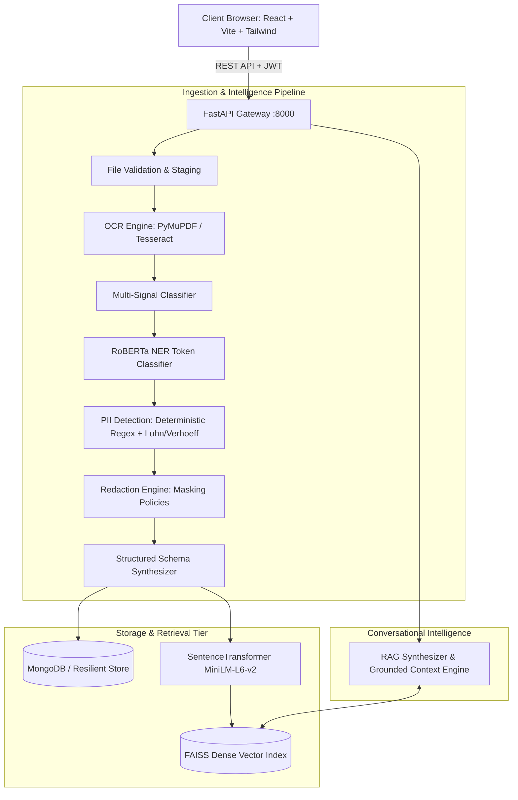

# DocIntel AI - System Architecture

## Overview
**DocIntel AI** is an enterprise-grade document intelligence, extraction, and privacy protection platform designed to process high volumes of invoices, contracts, identity proofs, and application forms. It automates OCR ingestion, neural entity recognition (RoBERTa), deterministic PII masking, schema-based structured extraction, and vector-grounded RAG query answering.

---

## Architectural Components

---

## Processing Pipeline Sequence

1. **Document Upload & Format Verification**
   - Supports `.pdf`, `.jpg`, `.jpeg`, `.png` up to 15MB.
   - Enforces filename sanitization, UUID generation (`DOC-XXXXXX`), and temporary secure storage.

2. **Optical Character Recognition (OCR)**
   - PyMuPDF native text extraction with automatic rasterization fallback (300 DPI) for scanned PDFs.
   - PIL image preprocessing: grayscale conversion, contrast enhancement (1.8x), sharpness sharpening (1.5x), and adaptive thresholding.
   - Tesseract OCR engine computing word-level confidence metrics.

3. **Document Classification**
   - Multi-signal classifier categorizing documents into `Invoice`, `Contract`, `Identity`, `Application`, `Form`, or `Other`.
   - Combines weighted keyword signals and contextual regex signatures.

4. **RoBERTa Named Entity Recognition (NER)**
   - Hugging Face `transformers` token classification pipeline.
   - Default configurable model: `Jean-Baptiste/roberta-large-ner-english`.
   - Normalizes tags into canonical types: `PERSON`, `ORGANIZATION`, `LOCATION`, `DATE`.
   - Built-in heuristic fallback for offline or zero-GPU execution environments.

5. **Deterministic PII Detection & Validation**
   - Regular expression pattern matching with checksum validations:
     - **Aadhaar:** 12-digit Indian national UID with Verhoeff algorithm verification.
     - **PAN:** Permanent Account Number format validation (`[A-Z]{5}[0-9]{4}[A-Z]`).
     - **Credit Cards:** Luhn checksum (MOD 10) validation.
     - **Emails, Phones, Bank Accounts:** RFC/ITU-compliant boundary extraction.

6. **Redaction & Security Rule Enforcement**
   - Dynamic policy engine with configurable rules persisted in MongoDB.
   - Sensitive values masked prior to vector indexing (e.g. `XXXX XXXX 9012`, `r***@example.com`, `XXXXX1234F`).

7. **Typed Structured Extraction**
   - Extracts typed JSON schemas per document category.
   - Missing fields default to `"N/A"` or `null` to avoid hallucination.

8. **Dual Persistence Tier**
   - **MongoDB Native:** Stores document metadata, raw and redacted texts, entity arrays, and audit logs with compound text indexes.
   - **Resilient Fallback:** Automatically switches to an in-memory + JSON persisted store if a MongoDB instance is not detected locally.
   - **FAISS Vector Store:** Chunks redacted documents, computes 384-dimensional dense vectors using `all-MiniLM-L6-v2`, and enables cosine similarity search for RAG queries.
